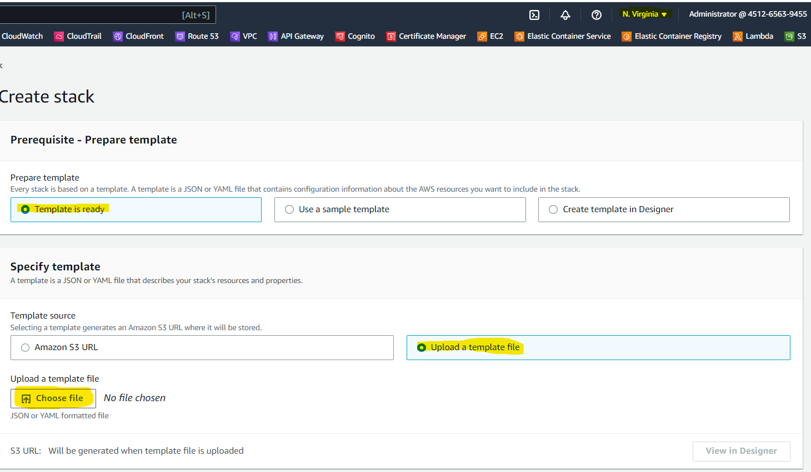
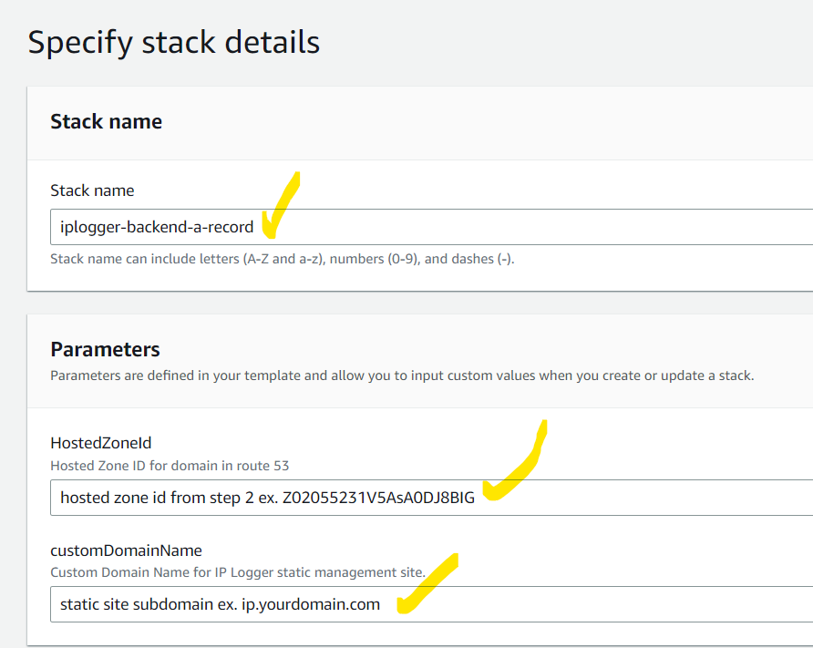
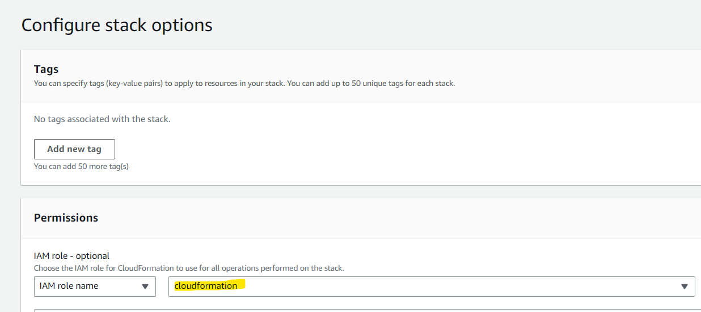
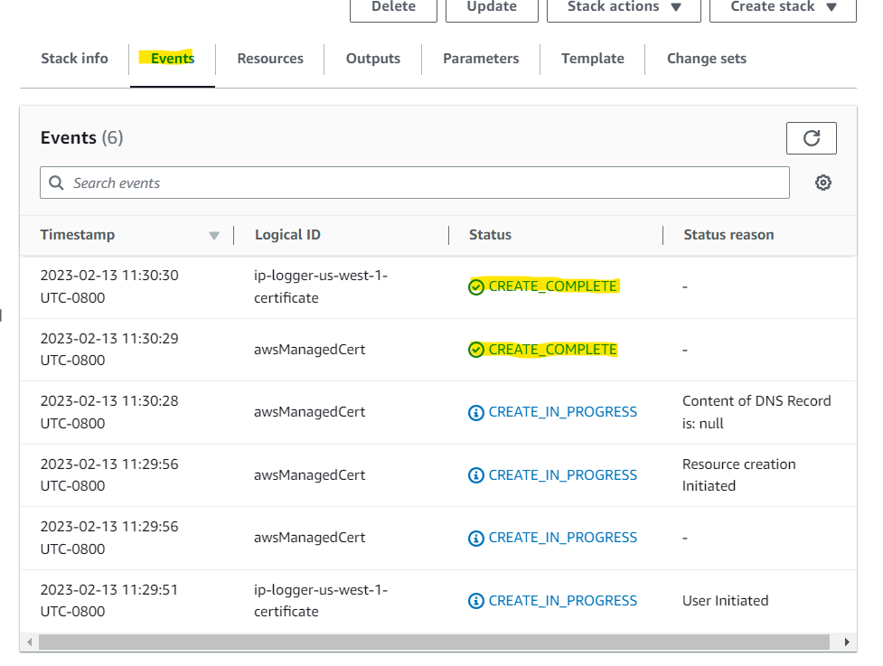

# A Distributed IP Logging service

## Use Cases: Log IP addresses, on a regular schedule, for all the members of a group/team. While chrome is running it will log the users IP every 30 minutes. Useful for creating IP white/black lists for metrics, security purposes, etc.

## Use a client side browser extension to capture IPs.

- A client side browser extension, built using React, for chrome.
- User configurable webhook allows logging IP to specified API endpoint.
- Tag IP addresses with user defined key/value pairs, useful for filtering & sorting IP data.

## Use AWS serverless architecture to store and review logged IPs.

- Serverless architecture uses [API Gateway](https://aws.amazon.com/api-gateway/), [Lambda](https://aws.amazon.com/lambda/), [Cloudfront CDN](https://aws.amazon.com/cloudfront/), [DynamoDB](https://aws.amazon.com/dynamodb/).
- Easily Deployed using [Cloudformation](https://aws.amazon.com/cloudformation/) scripts to your AWS account.
- Minimize costs by avoiding paying for compute, virtual machines, or containers.

## Requirements to fully deploy this project

- Nodejs to compile your browser extension. (installed with v. 14.x)
- An AWS Account
- A domain name controlled by a hosted zone in [AWS Route53](https://aws.amazon.com/route53/)

### Folder Structure

- Cloudformation: Deployment Scripts for your AWS archtecture
- extension: The client side web application used to log IPs.
- ipmanagementPage: A simple static site for reviewing logged ips
- lambda: Source code for backend APIs.
 
 Additional implementation details available in subfolder Readme.md files.

## Client Side Installation & Setup:

##### Required [Node Package Manager(NPM)](https://www.npmjs.com/)

1. Run the following commands from the CLI:

```
> cd /extension
> npm install
> npm run build
```

2. In chrome, navigate to:  [chrome://extensions/](chrome://extensions/)
3. Click "Load Unpacked"
4. Navigate to ./extension/dist and click "select folder"
5. Verify that installation was successful:


6. Consider pinning the extension while verifying setup:


7. Open the extension and set webhook and username/email. Note that provided cloudformation template will deploy loggin API endpoint to https://yourdomain.com/logip


8. Add any additional ip key/value pair tags by using the "New Query Parameter" option


9. After completing backend setup; Verify backend setup is working, and webhook is configured, by clicking Log IP:


## Backend Setup:

Backend services can be setup using the AWS console.
This guide assumes you have already purchased a domain name and it's part of aN aws route53 hosted zone.
Cloudformation will require an [IAM](https://aws.amazon.com/iam/) role with necessary permissions to deploy the backend Cloudformation stacks.
If you do not already have a couldformation role setup navigate to IAM in the AWS console and create a role withe the trust relationship shown below. Attach "AdministratorAccess" permission to the role.

```
{
    "Version": "2012-10-17",s
    "Statement": [
        {
            "Sid": "",
            "Effect": "Allow",
            "Principal": {
                "Service": "cloudformation.amazonaws.com"
            },
            "Action": "sts:AssumeRole"
        }
    ]
}
```

With your cloudformation role created, and your domain added to your AWS Route53 hosted zone:

1. Login to AWS console and navigate to route53, click hosted zones, and select the desired hosted zone name hyperlink.
2. Click "hosted zone details" and take note of the "hosted zone Id". You will need it while setting up cloudformation stacks.
3. Navigate to "Cloudformation" in the AWS. This applications cloud formation stacks should be able to be deployed to most regions. However, the A-Record for the stack management page needs to be hosted in us-east-1 to meet cloudformation requirements. Make sure your current region is us-east-1
4. Click "create stack" & select "with new resource".
5. Click "template is ready" -> upload a template file -> choose file -> navigate to ./cloudformation and select "ipManagment.us-east-1.yml" then click next.



6. Setup your stack details. See instructions shown below. Fill everything out then hit next.



6. Select your cloudformation role, that has necesarry permissions, then click next.



7. Review your setup then click "Submit". 

8. You should be taken to your new stacks "events" screen. Wait for the create of your stack to reach the complete stage:



9. If you have a desied deployment region, you can now switch to that region ex. "us-west-1"

### Repeat the above steps above for the remaining cloudformation templates in the order shown below. Stack paramater values shown as bullet points and used in step 6

1. dynamodb.yml
    - readCapacityUnits: 5 <-- minimum amount, increase as needed.
    - writeCapacityUnits: 10 <-- minimum amount, increase as needed.
2. lambda.yml
3. apiGateway.yml
    - customDomainName: api.yourdomainname.com <-- update yourdomainname
    - HostedZoneId: alpha numeric string noted in step 2.
4. ipmanagementpage.yml
    - customDomainName: api.yourdomainname.com <-- update yourdomainname
    - HostedZoneId: string noted in step 2.

10. After all stack deployments are complete you need to compile your static site and upload it to the s3 site bucket that was created by your IP Management Page stack. See the readme in /ipmanagementpage for instructions on .env file and build commands. Your apikey should have been created by the apiGateway stack. In the aws console, navigate to API Gateway, select your api, select API Keys, click your api key (you may need to scroll up) then click "show".

```
> cd ./ipmanagementpage
> touch .env <-- see readme.md in /ipmanagementpage for setup instructions.
> npm install
> npm run build
```

11. With build complete, navigate to s3 in the AWS console. Find the cloudformation bucket for your site(no the logging bucket). Click the bucket name, upload, and upload both the files and folders from ./ipmanagementpage/build


## Developers Notes:

Your static management page is deployed using the global content delivery network(CDN) Cloudformation. If you make any modifications to the site, then upload the changes to s3, you will not immediatly be able to see the changes. It can take up to 24 hours for the CDN cache to reach end of life(TTL) and get replated. If you go to Cloudfront in the AWS console you can create an invalidation to immediately be able to review your changes. To invalidate everything enter " /* " in the invalidation config box.

Your static site is protected by a cloudfront function that uses a default username and password: john/foobar. See ./cloudfrontFunction/auth.js for instructions on how to update the code. Any changes to auth.js need to migrated over to ./cloudformation/ipmanagementpage.yml then the stack needs to be updated. See authFunction -> FunctionCode in the .yml file.