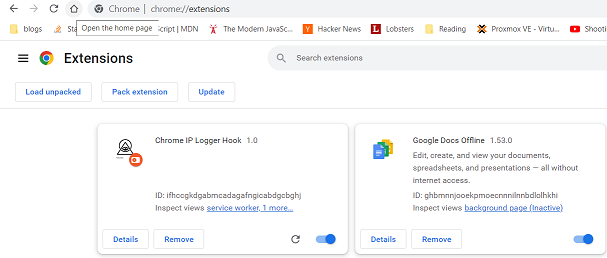
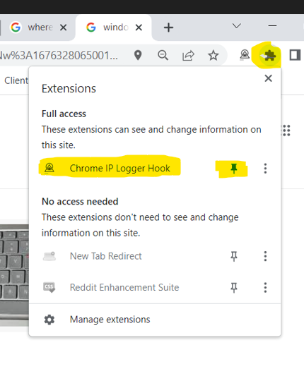
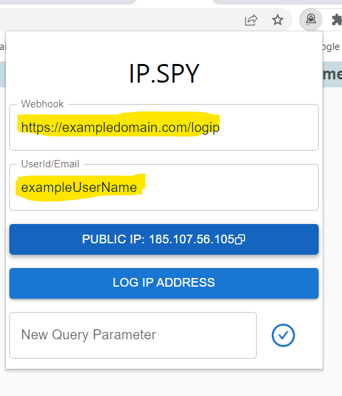
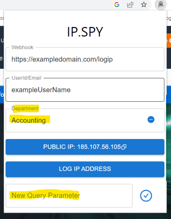
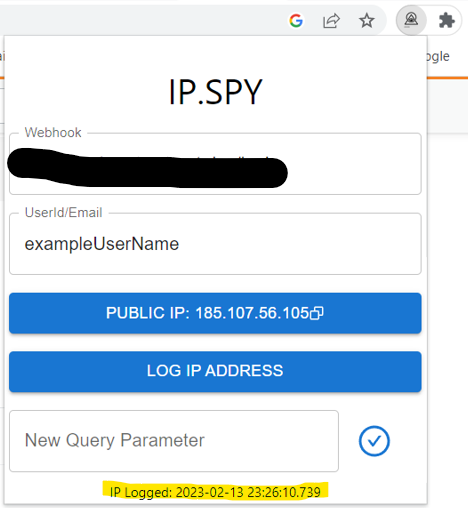

# A Distributed IP Logging service

## Use Cases: Log IP addresses, on a regular schedule, for all the members of a group/team. While chrome is running it will log the users IP every 30 minutes. Useful for creating IP white/black lists for metrics, security purposes, etc.

## Use a client side browser extension to capture IPs.

- A client side browser extension, built using React, for chrome.
- User configurable webhook allows logging IP to specified API endpoint.
- Tag IP addresses with user defined key/value pairs, useful for filtering & sorting IP data.

## Use AWS serverless architecture to store and review logged IPs.

- Serverless architecture uses [API Gateway](https://aws.amazon.com/api-gateway/), [Lambda](https://aws.amazon.com/lambda/), [Cloudfront CDN](https://aws.amazon.com/cloudfront/), [DynamoDB](https://aws.amazon.com/dynamodb/).
- Easily Deployed using [Cloudformation](https://aws.amazon.com/cloudformation/) scripts to your AWS account.

## Requirements to fully deploy this project

- Nodejs to compile your browser extension. (installed with v. 14.x)
- An AWS Account
- A domain name controlled by a hosted zone in [AWS Route53](https://aws.amazon.com/route53/)

### Folder Structure

- Cloudformation: Deployment Scripts for your AWS archtecture
- extension: The client side web application used to log IPs.
- ipmanagementPage: A simple static site for reviewing logged ips
- lambda: Source code for backend APIs.
 
 Additional implementation details available in subfolder Readme.md files.

### Client Side Installation

##### Required [Node Package Manager(NPM)](https://www.npmjs.com/)

1. Run the following commands from the CLI:

```
> cd /extension
> npm install
> npm run build
```

2. In chrome, navigate to:  [chrome://extensions/](chrome://extensions/)
3. Click "Load Unpacked"
4. Navigate to ./extension/dist and click "select folder"
5. Verify that installation was successful:



6. Consider pinning the extension while verifying setup:



7. Open the extension and set webhook and username/email. Note that provided cloudformation template will deploy loggin API endpoint to https://yourdomain.com/logip



8. Add any additional ip key/value pair tags by using the "New Query Parameter" option



9. After completing backend setup; Verify backend setup is working, and webhook is configured, by clicking Log IP:

