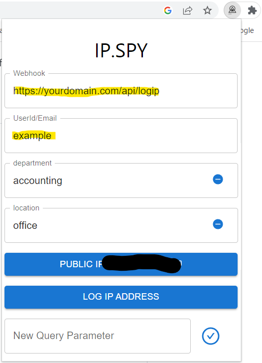

# A Distributed IP Logging service

## Use Cases: Regulary log Ip's for all the members of a group/team. While chrome is running it will log the users IP every 30 minutes. Useful for creating IP white/blacklists for metrics, security purposes, etc

## Use a client-side browser extension to capture IPs

- A client-side browser extension, built using React, for chrome.
- User configurable webhook allows logging IP to specified API endpoint.
- Tag IP addresses with user defined key/value pairs, useful for filtering & sorting IP data.

## Use AWS serverless architecture to store and review logged IPs

- Serverless architecture uses [API Gateway](https://aws.amazon.com/api-gateway/), [Lambda](https://aws.amazon.com/lambda/), [CloudFront CDN](https://aws.amazon.com/cloudfront/), [DynamoDB](https://aws.amazon.com/dynamodb/).
- Easily Deployed using [Cloudformation](https://aws.amazon.com/cloudformation/) scripts to your AWS account.
- Minimize costs by avoiding paying for compute, virtual machines, or containers.

## Requirements to fully deploy this project

- Nodejs to compile your browser extension. (Installed with v14.x)
- An AWS Account
- A domain name controlled by a hosted zone in [AWS Route53](https://aws.amazon.com/route53/)

### Folder Structure

- Cloudformation: Deployment Scripts for your AWS architecture
- extension: The client-side web application used to log IPs.
- ipmanagementPage: A simple static site for reviewing logged ips
- lambda: Source code for backend APIs.
- img: images used in this guide.

 Additional implementation details available in subfolder Readme.md files.

## Client-Side Installation & Setup

### Required [Node Package Manager(NPM)](https://www.npmjs.com/)

1. Run the following commands from the CLI:

```CLI
> cd /extension
> npm install
> npm run build
```

2. In chrome, navigate to:  [chrome://extensions/](chrome://extensions/)
3. Click "Load Unpacked."
4. Navigate to ./extension/dist and click "select folder"
5. Verify that installation was successful:


6. Consider pinning the extension while verifying setup:


7. Open the extension and set webhook and username/email. Note that provided Cloudformation template will deploy login API endpoint to yourdomain.com/api/logip



8. Add any additional IP key/value pair tags by using the "New Query Parameter" option


9. After completing backend setup; Verify backend setup is working, and webhook is configured, by clicking Log IP:


## Backend Setup

Backend services can be setup using the AWS console.
This guide assumes you have already purchased a domain name and it's part of an [AWS route53 hosted zone](https://docs.aws.amazon.com/Route53/latest/DeveloperGuide/hosted-zones-working-with.html).
Cloudformation will require an [IAM](https://aws.amazon.com/iam/) role with necessary permissions to deploy the backend Cloudformation stacks.
If you do not already have a CloudFormation role setup navigate to IAM in the AWS console and create a role with the trust relationship shown below. Attach "AdministratorAccess" permission to the role.

It's recommended that you create your stacks in us-east-1.

```JSON
{
    "Version": "2012-10-17",
    "Statement": [
        {
            "Sid": "",
            "Effect": "Allow",
            "Principal": {
                "Service": "cloudformation.amazonaws.com"
            },
            "Action": "sts:AssumeRole"
        }
    ]
}
```

With your CloudFormation role created and your domain added to your AWS Route53 hosted zone:

1. Login to AWS console and navigate to route53, click hosted zones, and select the desired hosted zone name hyperlink.
2. Click "hosted zone details" and take note of the "hosted zone Id". You will need it while setting up CloudFormation stacks.
3. Navigate to "Cloudformation" in the AWS. This applications cloud formation stacks should be able to be deployed to most regions. However, the A-Record for the stack management page needs to be hosted in us-east-1 to meet CloudFormation requirements. Make sure your current region is us-east-1
4. Click "create stack" & select "with new resource".
5. Click "template is ready" -> upload a template file -> choose file -> navigate to ./cloudformation and select "ipManagment.us-east-1.yml" then click next.


6. Setup your stack details. See instructions shown below. Fill everything out then hit next.


7. Select the role you configured for CloudFormation then click next.


8. Review your setup then click "Submit". 

9. You should be taken to your new stacks "events" screen. Wait for the create of your stack to reach the complete stage:


10. If you have a desired deployment region, you can now switch to that region ex. "us-west-1". It is recommended that your deploy to us-east-1.

### Repeat the above steps above for the remaining CloudFormation templates in the order shown below. Stack parameter values shown as bullet points and used in step 6

1. dynamodb.yml: Creates a dynamoDB table used to store logged IP data.
    - readCapacityUnits: 5 <-- minimum amount, increase as needed.
    - writeCapacityUnits: 10 <-- minimum amount, increase as needed.
2. lambda.yml: Creates Lambda Functions that retrieve and store IPs in dynamo
3. apiGateway.yml: Creates API endpoints that interact with Lambdas
    - HostedZoneId: alpha numeric string noted in step 2.
4. ipmanagementpage.yml: Deploys a simple static webpage for reviewing stored IPs.
    - customDomainName: yourdomain.com <-- update yourdomain
    - HostedZoneId: string noted in step 2.
    - CertficateARN: Amazon Resource Name(ARN) for certificate created in step 1. Go to us-east-1, Certficate manager, select your certficate, and copy the ARN.
    - username: site username
    - password: site password

 After all stack deployments are complete you need to compile your static site and upload it to the s3.

```CLI
> cd ./ipmanagementpage
> npm install
> npm run build
```

Navigate to s3 in the AWS console. Find the CloudFormation bucket for your site. Click the bucket name, click upload, and upload both the files and folders from ./ipmanagementpage/build.

## Developers Notes

If your primary domain is already in use the cloudformation scripts will allow you to use a subdomain for your backend services. Instead of using yourdomain.com you could use ip.yourdomain.com

Your static management page is deployed using the global Content Delivery Network(CDN) CloudFront. CloudFront will cache old versions of your site for up to 24 hours. If you make an update to your management site and want to immediately see the changes you can [create an invalidation in CloudFront](https://docs.aws.amazon.com/AmazonCloudFront/latest/DeveloperGuide/Invalidation.html) or add a query paramater to your domain name ex. yourdomain.com?1=1

Use curl to verify that your API endpoints are working correctly

> curl -v -X GET https://yourdomain.com/api/getips

> curl -v -X POST -H "Content-Type: application/json" -d '{"ip":"9.9.9.9", "userid":"testuser","date":"1999-12-31"}' https://yourdomain.com/api/logip

If your static site returns a "403: Not authorized" error changes are you forgot to upload your static site to s3.

Chrome extension documentation is available at: [https://developer.chrome.com/docs/extensions/](https://developer.chrome.com/docs/extensions/). WIth a [Chrome Developer Account](https://developer.chrome.com/docs/webstore/register/) you can publish your own extension build and share it with your team. Warning, it can take some time for your app to get approved.
